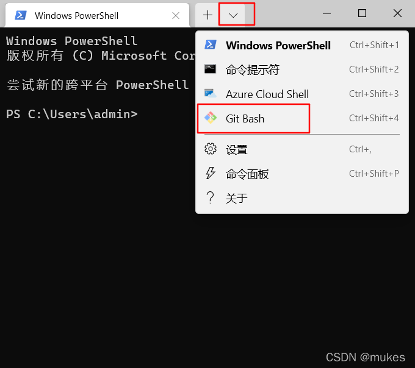

# Git安装教程

Git国内安装教程

[toc]{level: [2]}

## git下载
git官网地址
https://git-scm.com/
git官网下载慢我们可以使用淘宝开源的镜像地址下载
https://registry.npmmirror.com/binary.html?path=git-for-windows/
## git安装
1. 使用许可声明
    
    双击下载后的 Git-2.31.1-64-bit.exe Git-2.35.1.2-64-bit.exe，开始安装，这个界面主要展示了 GPL 第 2 版协议1的内容，点击 [next] 到第二步
    
    
1. 选择安装目录
    
    可点击 “Browse…” 更换目录，也可直接在方框里面改，我一般直接将 “C” 改为 “D”，这样就直接安装在 D 盘里了。点击 [next] 到第三步

    
1. 选择安装组件
   
   图中这些英文都比较简单，我已经把大概意思翻译出来了，大家根据自己的需要选择勾选。点击 [next] 到第四步

   

    注：最后一个选项打勾的话，需要下载 Windows Terminal 配合 Git Bash使用，如图：

   
1. 选择开始菜单文件夹 
   
   方框内 Git 可改为其他名字，也可点击 “Browse...” 选择其他文件夹或者给"Don't create a Start Menu folder" 打勾不要文件夹，点击 [next] 到第五步

   
1. 选择 Git 默认编辑器
    
    Git 安装程序里面内置了 10 种编辑器供你挑选，比如 Atom、Notepad、Notepad++、Sublime Text、
    Visual Studio Code、Vim 等等，默认的是 Vim ，选择 Vim 后可以直接进行到下一步，但是 Vim 是纯
    命令行，操作有点难度，需要学习。如果选其他编辑器，则还需要去其官网安装后才能进行下一步
    
    下图为默认编辑器 Vim.可直接点击 [next] 到第六步

    

    如果你不想用 Vim 当默认编辑器，换一个，比如 Notepad++ ，那么你者需要点击下面的蓝色字体 
    " Notepad++ " 去其官网下载安装好才能进行下一步 [next]

    

    安装后还要配置在我的电脑->属性->高级系统设置->高级->环境变量->系统变量->Path->编辑添加 
    Notepad++ 的安装地址，如 C:\Program Files\notepad++这样才能在Git Bash里面直接调用Notepad++
1. 决定初始化新项目(仓库)的主干名字

    第一种是让 Git 自己选择，名字是 master ，但是未来也有可能会改为其他名字；第二种是我们自行决定，默认是 main，当然，你也可以改为其他的名字。一般默认第一种，点击 [next] 到第七步

    注： 第二个选项下面有个 NEW！ ，说很多团队已经重命名他们的默认主干名为 main . 这是因为2020 年非裔男子乔治·弗洛伊德因白人警察暴力执法惨死而掀起的 Black Lives Matter(黑人的命也是命)运动，很多人认为 master 不尊重黑人，呼吁改为 main

    
1. 调整你的 path 环境变量

    第一种是仅从 Git Bash 使用 Git。这个的意思就是你只能通过 Git 安装后的 Git Bash 来使用 Git ，其他的什么命令提示符啊等第三方软件都不行

    第二种是从命令行以及第三方软件进行 Git。这个就是在第一种基础上进行第三方支持，你将能够从 Git Bash，命令提示符(cmd) 和 Windows PowerShell 以及可以从 Windows 系统环境变量中寻找 Git 的任何第三方软件中使用 Git。推荐使用这个

    第三种是从命令提示符使用 Git 和可选的 Unix 工具。选择这种将覆盖 Windows 工具，如 “ find 和 sort ”。只有在了解其含义后才使用此选项。一句话，适合比较懂的人折腾

   
1. 选择 SSH 执行文件
   
   

    注：这是一个新功能，我 2023-01-01 安装的 2.39.0 版本并没有这个选项，先按默认的来吧，先填个坑，有机会再补充
1. 选择HTTPS后端传输
    
    

    如果在具有企业管理证书的组织中使用 Git，则将需要使用安全通道。如果你仅使用 Git 来访问公共存储库（例如 GitHub ），或者你的组织不管理自己的证书，那么使用 SSL 后端（它们只是同一协议的不同实现）就可以了。也就是说，作为普通用户，只是用 Git 来访问 Github、GitLab 等网站，选择前者就行了。点击 [next] 到第十步
1. 配置行尾符号转换
  
    这三种选择分别是，签出 Windows 样式，提交 Unix 样式的行结尾 按原样签出，提交Unix样式的行结尾 按原样签出，按原样提交 我们这里怎么选择，我们现在的教程就是介绍怎么安装 Windows 版 Git，肯定选第一项啦

  

11. 配置终端模拟器以与 Git Bash 一起使用

    

    建议选择第一种，MinTTY 3功能比 cmd 多，cmd 只不过 比 MinTTY 更适合处理 Windows 的一些接口问题，这个对 Git 用处不大，除此之外 Windows 的默认控制台窗口（cmd）有很多劣势，比如 cmd 具有非常有限的默认历史记录回滚堆栈和糟糕的字体编码等等。
    相比之下，MinTTY 具有可调整大小的窗口和其他有用的可配置选项，可以通过右键单击的工具栏来打开它们 git-bash 。点击 [next] 到第十二步

1. 选择默认的 “git pull” 行为

   

    上面给了三个 “git pull” 的行为
    第一个是 merge
    第二个是 rebase
    第三个是 直接获取
    第一种 git pull = git fetch + git merge
    第二种 git pull = git fetch + git rebase
    第三种 git pull = git fetch ？(这个没试过，纯属猜测一般默认选择第一项，git rebase 绝大部分程序员都用不好或者不懂，而且风险很大，但是很多会用的人也很推崇，但是用不好就是灾难）
    git pull 只是拉取远程分支并与本地分支合并，而 git fetch 只是拉取远程分支，怎么合并，选择 merge 还是 rebase ，可以再做选择
1. 选择一个凭证帮助程序

    

    一共两个选项：Git 凭证管理 不使用凭证助手 第一个选项是提供登录凭证帮助的，Git 有时需要用户的凭据才能执行操作；例如，可能需要输入用户名和密码才能通过 HTTP 访问远程存储库（GitHub，GItLab 等等 我选的是一第个
1.  配置额外的选项

    

    有两个选项启用文件系统缓存，启用符号链接，启用文件系统缓存就是将批量读取文件系统数据并将其缓存在内存中以进行某些操作，可以显著提升性能。这个选项默认开启。启用符号链接 ，符号链接是一类特殊的文件， 其包含有一条以绝对路径或者相对路径的形式指向其它文件或者目录的引用，类似于 Windows 的快捷方式，不完全等同 类Unix（如 Linux） 下的 符号链接。因为该功能的支持需要一些条件，所以默认不开启
1. 配置实验性选项
    
    

    这是实验性功能，可能会有一些小错误之类的，建议不用开启
1. 最后点击install安装

    
    
    安装成功 ✌️